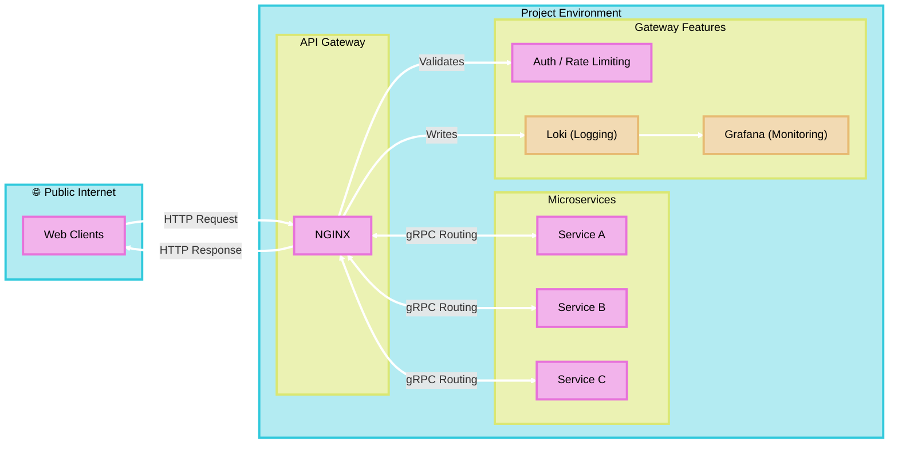

```mermaid
flowchart LR
    %% Top row: Public Internet -> Gateway -> Microservices
    subgraph Public_Internet["🌐 Public Internet"]
        WebClients["Web Clients"]
    end

    subgraph Project["Project Environment"]
        %% API Gateway (top row)
        subgraph Gateway["API Gateway"]
            NGINX["NGINX"]
        end

        %% Microservices (top row)
        subgraph Microservices["Microservices"]
            ServiceA["Service A"]
            ServiceB["Service B"]
            ServiceC["Service C"]
        end

        %% Gateway Features (bottom row)
        subgraph Gateway_Features["Gateway Features"]
            direction TB
            AuthRateLimit["Auth / Rate Limiting"]
            Loki["Loki (Logging)"]
            Grafana["Grafana (Monitoring)"]
        end
    end

    %% Connections
    WebClients --"HTTP Request"--> NGINX
    NGINX --"HTTP Response"--> WebClients
    NGINX <--"gRPC Routing"--> ServiceA
    NGINX <--"gRPC Routing"--> ServiceB
    NGINX <--"gRPC Routing"--> ServiceC

    NGINX --"Validates"--> AuthRateLimit
    NGINX --"Writes"--> Loki
    Loki --> Grafana

    %% Colours
    classDef outer fill:#b3ebf2,stroke:#31c9dc,stroke-width:0.2em,color:#000;
    class Public_Internet outer;
    class Project outer;

    classDef inner fill:#ebf2b3,stroke:#dae772,stroke-width:0.2em,color:#000;
    class Gateway inner;
    class Gateway_Features inner;
    class Microservices inner;

    classDef nodes fill:#f2b3eb,stroke:#e772da,stroke-width:0.2em,color:#000;
    class WebClients nodes;
    class NGINX nodes;
    class ServiceA nodes;
    class ServiceB nodes;
    class ServiceC nodes;
    class AuthRateLimit nodes;
    
    classDef logs fill:#f2dab3,stroke:#e7ba72,stroke-width:0.2em,color:#000;
    class Loki logs;
    class Grafana logs;

    linkStyle default stroke:#fff,stroke-width:0.2em;

```