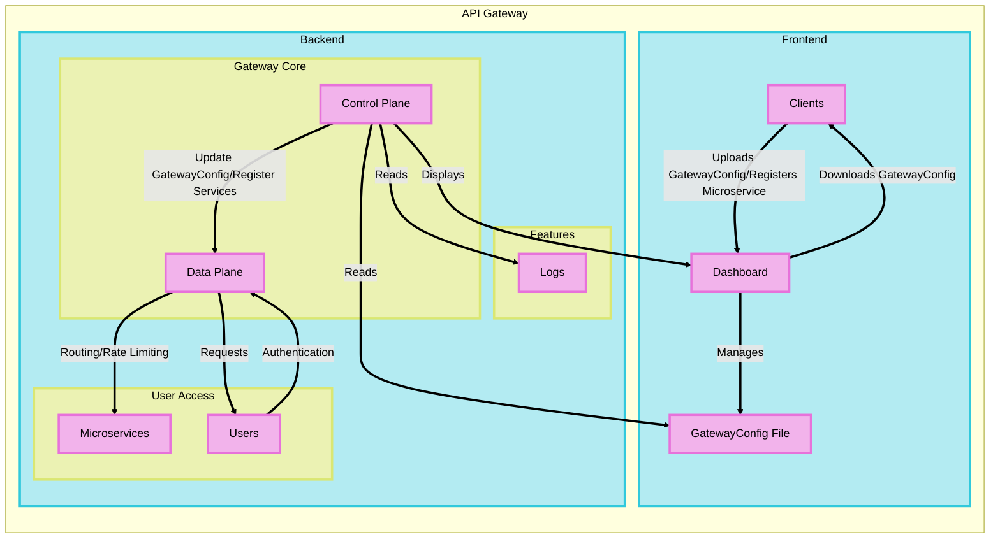

```mermaid
flowchart TB
%% Graphs
    subgraph Project["API Gateway"]
        direction TB

        subgraph Frontend["Frontend"]
            direction LR
            Clients["Clients"]
            Dashboard["Dashboard"]
            GatewayConfig["GatewayConfig File"]
        end

        subgraph Backend["Backend"]
            direction TB

            subgraph Features["Features"]
                Logs["Logs"]
            end

            subgraph Core["Gateway Core"]
                direction TB
                Control["Control Plane"]
                Data["Data Plane"]
            end

            subgraph UserAccess["User Access"]
                direction LR
                Microservices["Microservices"]
                Users["Users"]
            end
        end
    end

%% Connection
    Clients --"Uploads GatewayConfig/Registers Microservice"--> Dashboard
    Dashboard --"Downloads GatewayConfig"--> Clients
Dashboard --"Manages"--> GatewayConfig

Control --"Update GatewayConfig/Register Services"--> Data
Control --Displays--> Dashboard
Control --Reads--> GatewayConfig
Control --"Reads"--> Logs
Data --"Routing/Rate Limiting"--> Microservices
Data --Requests--> Users
Users --Authentication--> Data

%% Colours
classDef outer fill:#b3ebf2,stroke:#31c9dc,stroke-width:0.2em,color:#000;
class Frontend outer;
class Backend outer;

classDef inner fill:#ebf2b3,stroke:#dae772,stroke-width:0.2em,color:#000;
class Core inner;
class Features inner;
class UserAccess inner;

classDef nodes fill:#f2b3eb,stroke:#e772da,stroke-width:0.2em,color:#000;
class Control nodes;
class Data nodes;
class Clients nodes;
class Logs nodes;
class GatewayConfig nodes;
class Dashboard nodes;
class Microservices nodes;
class Users nodes;

linkStyle default stroke:#000,stroke-width:0.2em;
```